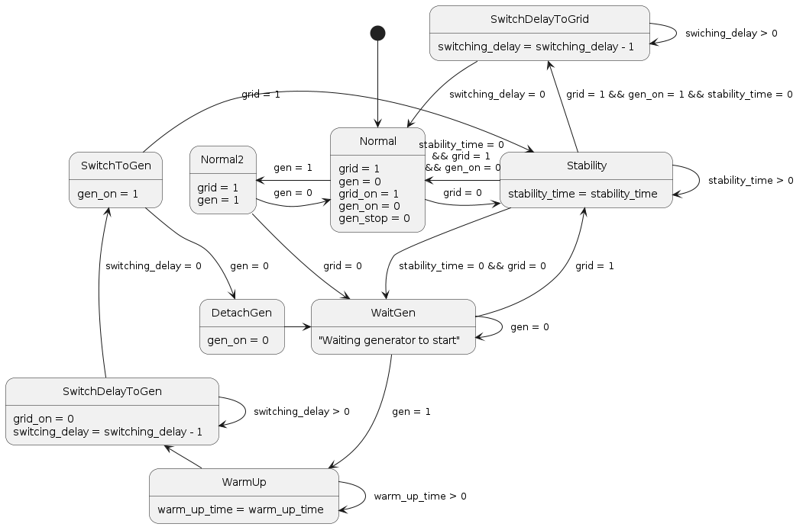

# ATS - Automatic Transfer Switch


Intelligent power switching between two power sources. Feed load from both grid and generator without manual hassle!

## Install

Automatic transfer switch requires following to be installed
- python3
- pip3
- platformio

Platfrmio can be installed by using pip
```bash
pip3 install -U platformio
```

After that you can install dependencies of the project
```bash
pio lib install
```

## Running tests

Tests are allowed to be executed only for the native environment that does not require real hardware to be connected to the tester.
Run tests by executing the following command
```bash
pio test -e native
```

## Building

Since platformio.ini includes two environmets (native & megaatmega2560 for Arduino Mega) you need to specify for which target you want to build project. To build for ATmega2560:
```bash
pio run -e megaatmega2560
```

Note that before building, pio launches pre python script that takes version of the project from VERSION file on root folder and defines that as definition that we'll use on our code.

## Running on simulator

The ATS repository root includes two essential files: diagram.json and wokwi.toml. These files enable you to run the project using the Wokwi simulator. To proceed:

1. Compile the project specifically for the megaatmega2560 configuration.

2. Launch the Wokwi simulator. If you are using the PlatformIO, the simulator will automatically detect the location of the executable. However, ensure that you do not compile for the 'native' environment as specified in platformio.ini.

<br />
<div>
    
</div>
<br />

### Simulator Components and Their Real-World Equivalents

Within the simulator, every essential component found in the real hardware is mirrored to provide an authentic experience including display, keypad, buzzer, LEDs and switches. 

**LED is as follows:**

Left LED: When illuminated, it indicates that the grid is being utilized to power the load

Right LED: If this LED is ON, it signifies that the generator (or genset) is being used, and the contactor is activated

**Switches: There are two switches in the simulator to indicate whether the grid and/or generator is delivering 250V to the system**

Note: In the real-world hardware, we employ voltage sensors to detect and display the exact voltage levels. However, since these sensors don't exist in our simulator, we've implemented these two switches as a substitute. These switches are binary, representing either 0V or 250V. This means we're assuming a voltage difference between 0 and 250V based solely on the switch's position. On actual hardware, the precise voltage is displayed thanks to the real voltage sensors


## Sketch about the idea / FSM

<br />
<div>
    
<div/>
<br />


## TODO

- Calibrate each voltage sensors separately from settings tab
- JUnit CI does not get real test results (only whether those fail or not)
- Beeper when button pressed
- When exiting settigns and going back in, vertical index of display variable breaks

🔌🏠🔌<br />
**Happy switching!**